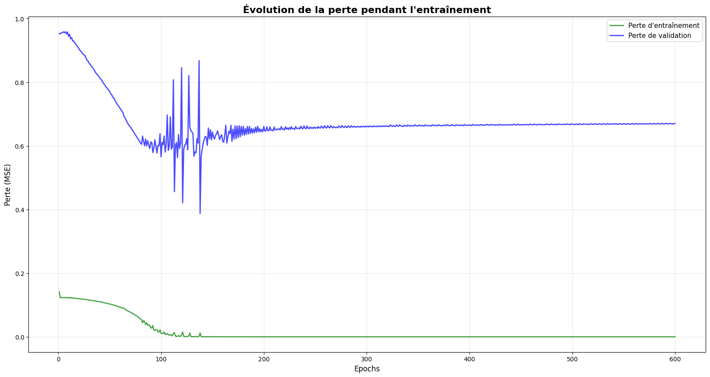

# IMU Motion Classification

An Arduino Nano 33 BLE IMU experiment linking six-axis acquisition, Python training and microcontroller inference. The uploaded datasets are named `Cercle.csv` and `carré.csv`.

## Repository guide

| Folder | Contents |
| --- | --- |
| [generate_data_to_train](generate_data_to_train/) | Acquisition sketch and Python serial-to-CSV logger |
| [Training /datatset](Training%20/datatset/) | Two recorded CSV datasets |
| [Training /notebooks](Training%20/notebooks/) | Jupyter training notebook |
| [Training /models](Training%20/models/) | `gesture_model.tflite` and matching `model.h` byte array |
| [inference_Arduino](inference_Arduino/) | TensorFlow Lite Micro inference sketch |
| [documentation](documentation/) | Original explanation of the experiment |

The existing folder names, including the space after `Training`, are preserved.

## Embedded pipeline

The sketches collect **119 samples** containing accelerometer and gyroscope values, giving **714 model inputs**. Training normalizes acceleration with `(a + 4) / 8` and angular velocity with `(g + 2000) / 4000`. Keep the same channel order and preprocessing in firmware.

The notebook defines a dense **714 → 50 → 15 → 2** network, with ReLU hidden layers and softmax outputs. The supplied TFLite model is **148,168 bytes**; its C-header representation was checked against the binary and matches exactly.

## Reproduce the experiment

1. Upload the acquisition sketch, then configure the logger's serial port and output filename; it uses **9600 baud**.
2. Set dataset paths and class order in the notebook before running it. The recorded environment uses Python 3.10 and TensorFlow 2.18.
3. Export the model and C header together. Place `model.h` alongside the inference sketch and install its IMU/TensorFlow Lite dependencies.
4. Confirm board/IMU compatibility, tensor allocation and predictions on the physical device.

## Recorded training result

This figure is extracted from the uploaded notebook, not a new training run. Its train/validation gap indicates that generalization needs further evaluation.

## Integration checks

The notebook uses `punch/flex`, the supplied CSVs use circle/square names, and firmware outputs `carré/cercle`. Reconcile filenames, class meaning and output order before retraining or interpreting predictions.

The saved notebook reports 2/2 correct test predictions, both from the same class. That tiny test does not establish reliable accuracy for the circle/square experiment. Use held-out acquisition sessions and report per-class results.
