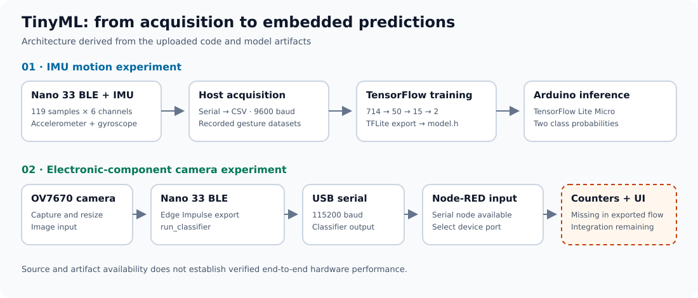

# TinyML on Arduino Nano 33 BLE

Two embedded machine-learning experiments: **IMU motion classification** and **camera-based electronic-component classification**. The repository now includes acquisition code, training material, exported models and inference firmware.

## System overview

## Repository guide

| Project | Available material |
| --- | --- |
| [IMU classification](PARTIE_1_ClassificationVibrations/) | Six-axis acquisition, serial-to-CSV logger, gesture datasets, TensorFlow notebook, matching TFLite/C-header model and Arduino inference sketch |
| [Component classification](Partie_2_ClassificationComposants/) | OV7670 camera sketch, Edge Impulse Arduino-library export, documentation and Node-RED serial-input flow |
| [Overview](Overview) | Original project introduction |

## Getting started

Start with the guide for your selected experiment. For the IMU track, collect **119 samples × 6 channels** per gesture, train/export on the host and include `model.h` with the inference sketch. The uploaded firmware uses `Arduino_LSM9DS1` and TensorFlow Lite for Microcontrollers.

For the camera track, install the supplied Edge Impulse library and the camera dependency before opening the sketch. Configure the host serial port in Node-RED.

## Implementation status

The default branch is `test`. Source code and model artifacts are available; board execution and end-to-end performance have not been revalidated during this documentation update.

The IMU guide explains the differing gesture labels in the uploaded files. The camera guide distinguishes the exported serial receiver from the component-counting dashboard described in the documentation.
